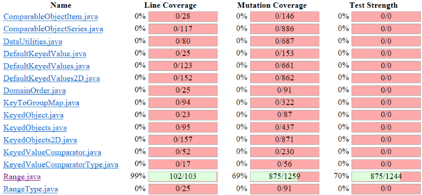
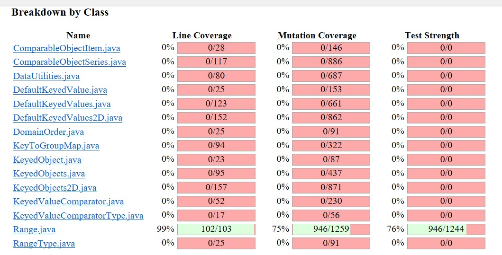
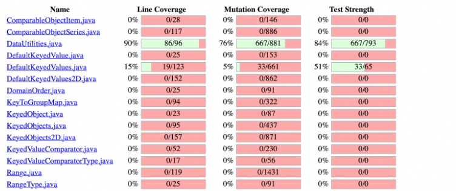
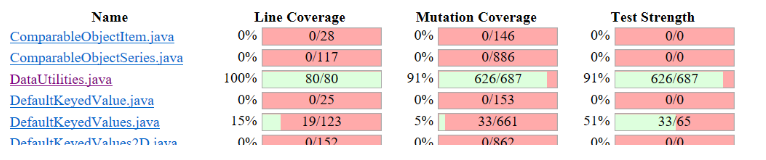
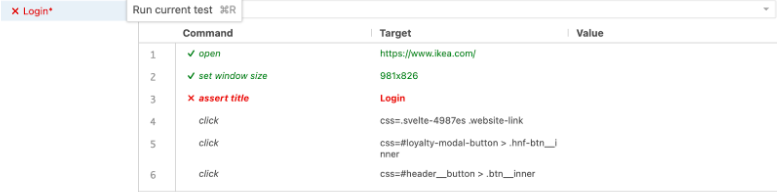
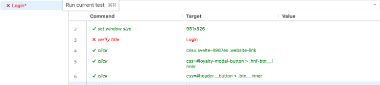

**SENG 438 - Software Testing, Reliability, and Quality**

**Lab. Report \#4 – Mutation Testing and Web app testing**

| Group \#:      |
| -------------- |
| Student Names: |
| Aleksander Rudolf                |
| Anshdeep Singh              |   
| Jannine Osman               |   
| Jaskaran Bhatia                | 

# Introduction
In this lab, we explored a mutation testing tool called Pitest built into eclipse. We also explored GUI testing. In the first part of the lab, we used Pitest on our test suites DataUtilitiesTest and RangeTest from assignment three. We examined the mutants produced by the Pitest for our Range test suite, looked at equivalent mutants, and added more test cases to increase our mutation score. For the GUI testing portion of the lab, we used the tool SELENIUM and designed UI test cases for our chosen website IKEA. We also looked at the tool Sikulix and compared its performance to SELENIUM.

# Analysis of 10 Mutants of the Range class 
1) intersects(Range range)
A mutant was introduced by hard coding the return value to be false. This mutant was KILLED  by the test cases, the test overlappingRangeIntersects() using Range(-10, 10) calls range.intersects(-9, 9) method, so the range actually intersects,  however as the return value is hard coded to false, this test fails, hence killing the mutant.

2) scale(Range base, double factor)
A  mutant was introduced on line number 410 by relacing factor < 0 by factor < -1.0, this mutant was NOT KILLED by any of the test cases as none of the test cases test the factor value which is less than -1.0. 

3) contains(double value)
A mutant was introduced by hard coding the return value to be false. This mutant was KILLED  by the test cases, the test containsValueBetweenUpperAndLowerBound() using Range(-10, 10) calls range.contains(5) method, so the range actually contains 5,  however as the return value is hard coded to false, this test fails, hence killing the mutant.

4) toString()
A mutant was introduced by doing post incementation of the variable lower, since it was post incrementation, the this.lower was first printed and then incremented, therefore, the test still passing and NOT KILLING the mutant by toStringWhenObjectIsNotNull().

5) getLength()
A mutant was introduced by replacing the negative sign by positive in code (this.upper - this.lower), this mutant was KILLED by the getLengthPositiveLowerUpperBound() as the range(1, 10) should have returned 9 and passes, however, because of the mutant, it returned 11 and failed.

6) getCentralValue()
A mutant introduced as instead of finding central value by doing division by 2, the division was done by 3, and hence giving a wrong value, getCentralValueNegativeLowerPositiveUpper() uses range(-20,10) making the central value -5, however, mutant changed the central value to be -3.33, making the test case fail, and hence mutant was KILLED.

7) expandToInclude(Range range, double value)
A mutant was introduced by replacing line number 302, where range == null with range!=null, this mutant was KILLED by expandToIncludeRangeLargerUpperBound() test case as the range = new Range(-30, 30) which is not null so it should have been expanded to upper bound of 40, but it did not happen because of the mutant and the test failed.

8) min(double d1, double d2)
A mutant was introduced by doing post incementation of the variable d1, since it was post incrementation, d1 was first used to determine min and then incremented, therefore, the test still passing and NOT KILLING the mutant as we missed test for this method as it is private.

9) max(double d1, double d2)
A mutant was introduced by doing post incementation of the variable d1, since it was post incrementation, d1 was first used to determine max and then incremented, therefore, the test still passing and NOT KILLING the mutant as we missed test for this method as it is private.

10) getCentralValue()
A mutant introduced as instead of finding central value by doing division by 2, the division was done by -1, and hence giving a wrong value, getCentralValueNegativeLowerPositiveUpper() uses range(-20,10) making the central value -5, however, mutant changed the central value to be 10, making the test case fail, and hence mutant was KILLED.

# Report all the statistics and the mutation score for each test class
## Range Class Original Mutation Score

## Range Class Updated Mutation Score

## DataUtilities Class Original Mutation Score

## DataUtilities Class Updated Mutation Score

# Analysis drawn on the effectiveness of each of the test classes
## Test cases added for the Range class
1) hashCodeWithAValue()
Earlier we were missing a test to actually look for the value calculated by the hashCode(), so we added a test and provided a range(2,6) which calculated the hash value to be -2145910784, after added this test, most of the mutants associated with hashCode() were Killed.

2) rangeConstructorLowerGreaterThanUpper()
This test was added because there was a mutant introduced which changed the if(lower > upper) conditional statement in the Range constructor to be if(true). In order to kill this mutant we needed to have this test case which expected an IllegalArgumentException to be thrown from the Range constructor, which did not occur when the conditional statement was changed to be true.

3) scaleByNegativeZeroPointFive()
We added this test because there was a mutant which survived with our old test suite, as there was a mutant introduced which changed the condition on line number 410 of the original code to if(factor < -1), we were missing a test case where scale factor was between -1 and 0, so we added a factor to be  -0.5 which actually killed the mutant.

4) rangeIntersectsBoundary()
We were earlier missing a test to look for a range which intersects the other range with same lower boundary value, so we introduced a test with range (3,4) and the testRange to be (3,3) and called the method intersect() which helped to kill all the mutants associated with the boundary values of the range.

## Test cases added for the DataUtilities class
1) getCumulativePercentagesDataIsNull()
This test was added because there was a mutant introduced which removed theParamChecks.nullNotPermitted(data, "data") from the getCumulativePercentages() function of the DataUtilities class . In order to kill this mutant we needed to have this test case which expected an IllegalArgumentException to be thrown from the DataUtilities getCumulativePercentages function, which did not occur because the check theParamChecks.nullNotPermitted(data, "data") was removed.

2) createNumberArray2DDataIsNull()
This test was added because there was a mutant introduced which removed theParamChecks.nullNotPermitted(data, "data") from the createNumberArray2D function of the DataUtilities class. In order to kill this mutant we needed to have this test case which expected an IllegalArgumentException to be thrown from the DataUtilities createNumberArray2D function, which did not occur because the check theParamChecks.nullNotPermitted(data, "data") was removed.

3) equalsWhenBothActuallyNotEqualWithUnequalRowButFirstTwoSame()
Earlier we were missing a test when two arrays were unequal such that array one had 2 subarray and array_2 had 3 subarray such that 2 subarrays of array_2 were exactly same as the array_1, so when a mutant was introduced such that if(a.length != b.length) was changed to if(false), the source code actually compared just the first two subaarays and returned true, however it should have been false, so introducing this test case killed the mutant

4) equalsWhenBothActuallyNotEqualWithUnequalRow_1()
Earlier we were missing a test when length of array ‘a’ was actually greater than array ‘b’, so in the earlier test suite, where the condition was changed to a.length <= b.length, the mutant survived, however after added a test case where array_1  = new double [][]{{5,7},{3,4,5},{5,6,7}} and array_2 = = new double [][]{{2,7},{3,4,5}}, the mutant was killed

5) equalsWhenBothActuallyNotEqualWithUnequalRow_2()
Earlier we were missing a test when length of array ‘a’ was actually lessthan array ‘b’, so in the earlier test suite, where the condition was changed to a.length >= b.length, the mutant survived, however after added a test case where array_2 = new double [][]{{5,7},{3,4,5},{5,6,7}} and array_1 = new double [][]{{2,7},{3,4,5}}, the mutant was killed

6) calculateColumnTotalWithThreeArguementDataIsNull()
This test was added because there was a mutant introduced which removed theParamChecks.nullNotPermitted(data, "data") from the calculateColumnTotal(Values2D data, int column,int[] validRows) function of the DataUtilities class. In order to kill this mutant we needed to have this test case which expected an IllegalArgumentException to be thrown from the DataUtilities calculateColumnTotal(Values2D data, int column,int[] validRows) function, which did not occur because the check theParamChecks.nullNotPermitted(data, "data") was removed.

7) calculateRowTotalWithThreeArguementDataIsNull()
This test was added because there was a mutant introduced which removed theParamChecks.nullNotPermitted(data, "data") from the calculateRowTotal(Values2D data, int row, int[] validCols) function of the DataUtilities class. In order to kill this mutant we needed to have this test case which expected an IllegalArgumentException to be thrown from the DataUtilities calculateRowTotal(Values2D data, int row, int[] validCols) function, which did not occur because the check theParamChecks.nullNotPermitted(data, "data") was removed.

# A discussion on the effect of equivalent mutants on mutation score accuracy
Equivalent mutants are semantically equivalent to the original program. This means equivalent mutants are not simulating bugs in the code. We also cannot kill equivalent mutants. The mutation score accuracy is the number of total killed mutants divided by the total mutations. The mutation score accuracy is thus inaccurate as the equivalent mutant cases are still considered in the total mutations but they cannot be killed by the test cases as they are equivalent to the original code. The score accuracy is then inaccurate as we cannot kill these mutants but they are counted in the total mutations.

# A discussion of what could have been done to improve the mutation score of the test suites
Our group first ran the Pitest software for both the Range and DataUtilities classes. DataUtilities had a mutation score of 76%, as there were some tests failing as we were not catching the appropriate exception, we changed test cases such that excepted exception was “IllegalArguementException” which killed significant amount of mutants. After running the Pitest software we examined the mutation score for both classes and then looked through the mutants that were not killed. We then designed test cases to kill the mutants that were not previously killed.There were some equivalent mutants which we cannot kill, however, we were able to bring mutant coverage of DataUtilities up to 91%. For the Range class there were more mutants in total, so to improve our test suite we wrote more test cases for boundary cases. Most mutants for the Range class that we’re not killed existed in the conditional statements, so we purposely targeted those mutants when improving our test suite. We were able to improve to 76% from 68% in the beginning. 

# Why do we need mutation testing? Advantages and disadvantages of mutation testing
## Advantages of mutant testing
Better code coverage: By highlighting sections that have not been checked, mutation testing can help to increase the code coverage. This could contribute to raising the overall quality of the code.
Improved Test Quality: By finding loopholes in the test cases, mutation testing can help to increase the test suite's quality. Finding possibilities that were overlooked during the initial development stage can be helpful.

## Disadvantages of mutant testing:
False Positives and Negatives: False positives and false negatives can result from mutation testing. False positives happen when the test cases pass despite the wrong mutation, and false negatives happen when the test cases fail despite the accurate mutation.
Time-consuming:  Due to the need to run the test suite repeatedly with various mutations, mutation testing can be time-consuming. When dealing with big codebases, this can be extremely difficult.

# Explain your SELENUIM test case design process
Our SELENUIM test case design had an exploratory testing approach. We initially explored the functionalities of the website to get used to the interface then broke down the website into simple functionalities. We tried to pick some more generic requirements for an e-commerce website to test for as well as some requirements that were unique to the website. Our chosen website was IKEA. We initially created a login account so that we could test the login and logout functionalities. Then we tested the process of browsing for items, adding an item to your cart, adding an item to your wishlist and viewing the wishlist and cart. We did not try to purchase functionalities as we did not want to make an actual purchase for the purpose of the lab. We did however test the 3D modeling feature that IKEA allows us to see items from all viewpoints. We also tested the compare feature to ensure we could compare multiple different items at different price points. Once we decided on our test cases we used the recording feature in SELENIUM to record the test case. Once the test case was recorded we ran the tests to ensure they were completed without issues. We ultimately had eleven total test cases and each group member completed at least two of them. We also shared our results with each other and showed each other the successful test cases before combining them into one file. 

## SELENUIM Test Cases
1) Add item to wish list 
2) Browse items and add items to the cart
3) Login (valid)
4) Login (invalid)
5) Logout
6) Remove the item from cart
7) Search for an item (Table)
8) Search for an item (Chair)
9) View item in 3D view
10) View the wish list 

# Explain the use of assertions and checkpoints
Assertions can be used to ensure that an expected and actual output is the same. For example, when logging in we can assert after mouse clicks that the user is actually navigated to the login page using an assert title command. If the assert condition is not met the whole test will be aborted at the line that the assert was on. Checkpoints or verification points allow you to check an expected or actual output but the test will not be aborted if the values do not match. Checkpoints will execute the whole test until the end and then show the number of errors that occurred at the end of the test script. Both are useful tools to ensure that the script is actually executed as wanted and is testing for errors or issues that may occur along the way. Checkpoints are valuable tools as you can see exactly how many times the expected and actual output varied. In contrast, you can only see where the first assert failed when using assertions and the rest of the script is terminated. Below is our login test with a failed assertion. The screenshot shows that the test stopped executing once it reached the failed assertion:

If we replace the same assertion with a verify command the entire test will be executed. This is shown in the screenshot below:

We used both asserts and validates to test points in our test cases to ensure that the script was directing to the right page and searching or entering the correct values provided. We didn’t use many assertions as in most of our tests we’re simply browsing through different pages on the website, added things to our cart and ensured they were in the cart and simply ensured that the website responded to the user input appropriately by navigating to the appropriate pages as needed. Verifications are mostly built-in to SELENIUM and if a click fails then the program will also show that. We can add additional verifications but for the most part, the software checks most of the commands automatically after each command. 

# How did you test each functionaity with different test data
For our chosen website, there weren’t very many inputs that we could actually vary within the test cases. The few test cases we could change were searching for items and logging in. The rest of the test cases were mostly clicked, mouse over and mouse out events, meaning we could not vary the values of items in those test cases. For the search for an item test case, we originally had the test search for a chair. We changed the input to search for a table and a lamp as well. When we recorded the test case initially with a chair we had the recording so the tester searched for a chair, browsed through the results and clicked upon the desired chair. When we switched the value input from chair to table, SELENIUM only simulated searching for the item, but could not browse or select a table since the test was recorded in the instance with a chair. We could rerecord the test case with a table as an input value, then browse the tables and select one in the recording in order to get the wanted behaviour from the automated test. Although we could change the input value chair, the test behaviour was not exactly what we would like and the test could not finish since it could not find the chair that was clicked upon in the recorded test case when tables were shown. The same situation occurred for when we changed the chair value to a lamp value. Another test case where we could change the input is the login information. Within the login test case, we could change the username and password values. Changing either of these meant that login was not successful and a user could not browse the website while being logged in when the input was changed. As a group we changed the input value for all the test cases we could but out of the eight test cases we wrote we could only manipulate the input values for two of them.

# Discuss advantages and disadvantages of Selenium vs. Sikulix
Our group members installed SELENIUM as a google chrome extension. The extension worked incredibly easily with our chosen website and was easy to navigate with little help. All of our group members were able to use SELENIUM with little guidance and the user interface was simple yet appealing. The installation process was also a breeze. This was not the case for Sikulix. Sikulix required a separate installation process and had to be downloaded onto our local machines. After installation, we had to approve the software for it to be able to control our mouse and screen record. Upon opening the Sikulix software we were shown a less modern and ambiguous interface that was not easy to navigate. SELENIUM was able able to store user’s input such as click, scroll and even mouse position while Sikulix did not have that feature. Sikulix used image recognition as a method of storing user interactions with the system. Although both methods could be useful in analyzing the user interface being tested our group found SELENIUM much easier to use. Both tools allow for test automation but SELENIUM can only be used for websites while Sikulix could be used for any kind of user interface such as an application installed on a user’s computer since it is image based. Some disadvantages of SELENIUM were that we had to ensure we logged out before testing the login test script otherwise the script would pause and not be resolved. SELENIUM also timed out a lot while trying to record our tests. Often times the website would become unresponsive when recording our test cases meaning we’d have to stop the recording, delete the test, recreate the test, then rerecord the test. This became very repetitive in some instances. Despite the downfalls of SELENIUM it still was quite easy to use and comprehend, while Sikulix took more time to get used to. 

# How the team work/effort was divided and managed
We had two members who initially troubleshoot the first part of the project while the other two group members got a head start on the second part. Dividing into two pairs for different parts of the assignment allowed each pair to troubleshoot problems in their part, then catch the other pair up on how to use the tools required. We had many issues with the PIT extension in Eclipse so we had one group troubleshoot how to get PIT working in Eclipse while the other pair worked on figuring out how to use SELENIUM. Once both groups finished troubleshooting we came together to complete both parts of the lab together. The group that worked on the mutation portion showed the other pair how to properly get PIT working in Eclipse. The group who worked with the SELENIUM software gave the other pair a tutorial on how to use the software and its features. This method allowed us to still make headway while troubleshooting problems we encountered during both sections. After we were able to get PIT working the mutation testing portion of the lab became a breeze and we all collectively worked to make our test suite better. We all worked together to discuss different mutants produced by the Pitest and how they are likely or unlikely killed by our test suite. We then brainstormed how we could improve upon our test suite and each wrote some more test cases. Once the mutation testing was done we worked on finalizing our SELENIUM test cases and recording them into a collective file. Dividing the work in this way allowed us to tackle both parts of the assignments at once and also allowed us to teach each other how to use the different tools used in each part of the lab. Lastly, this method of work allowed each of us to get hands-on experience with the mutation and GUI software and to help each other troubleshoot difficult challenges encountered during the lab. 

# Difficulties encountered, challenges overcome, and lessons learned
The worst difficulty that we encountered in this lab was setting up PIT in Eclipse. All members of our group tried to set up the extension in Eclipse the night before our lab so that when we got to our lab we could focus on the actual contents of the lab itself. Unfortunately, none of us successfully got PIT to work the night before the lab, and we spent the majority of the time in our lab troubleshooting which wasted a lot of time. After consulting with the TA we had a few options to look at how to solve this problem, but in the end, it took some experimenting and trial and error to fix the problem. We also had difficulties finding the equivalent mutants and test cases associated with them to improve upon our test suite. Another issue we had was installing Sikulixide. Although the installation process was quickly granting the proper access needed to test the software was quite difficult. We also had to look at multiple online resources to understand how to use Sikulixide. Although the user interface was quite simple, it was hard to understand what to do in comparison to SELENIUM. We also had an in-class demonstration of SELENIUM after our lab to confirm that what we did was correct but we did not see an in-class demonstration of Sikulixide. To conclude, setting up Eclipse with PIT was the hardest difficulty we encountered in this lab and we wasted a lot of time troubleshooting.

# Comments/feedback on the lab itself
Overall our group really enjoyed the aspects of course content that this lab covered. We enjoyed the mutant testing and the graphical user interface testing using SELENIUM. Our only feedback for the lab is that we would have appreciated more instructions on the assignment document for installing PIT successfully in the Eclipse project. We really struggled to get PIT working in Eclipse and it wasted a lot of our lab time. We also would have found it helpful if there was more information on reading the results of the Pitest and what things we could ignore when looking at the results. Overall clear instructions on the Pitest software with screenshots could have been greatly beneficial to our completion of this lab.
